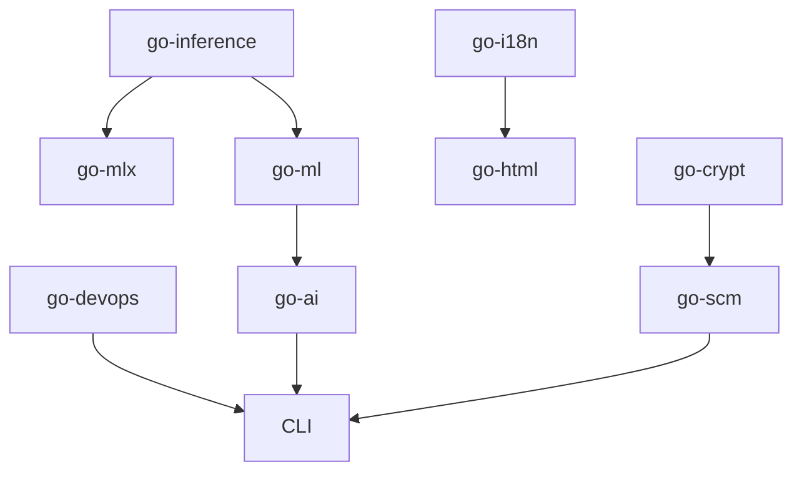

# Go Packages

The Core Go ecosystem is a collection of focused packages under `forge.lthn.ai/core/`.

| Package | Description |
|---------|-------------|
| [go-devops](go-devops.md) | Build automation, Ansible, release pipeline, infrastructure APIs |
| [go-ai](go-ai.md) | MCP hub — 49 tools for file ops, RAG, inference, browser automation |
| [go-ml](go-ml.md) | ML inference backends, scoring engine, agent orchestrator |
| [go-mlx](go-mlx.md) | Apple Metal GPU inference via mlx-c CGO bindings |
| [go-inference](go-inference.md) | Shared interface contract for text generation backends |
| [go-i18n](go-i18n.md) | Grammar engine — forward composition, reversal, GrammarImprint |
| [go-scm](go-scm.md) | SCM integration, AgentCI dispatch, Clotho Protocol |
| [go-html](go-html.md) | HLCRF DOM compositor with grammar pipeline and WASM |
| [go-crypt](go-crypt.md) | Cryptographic primitives, OpenPGP auth, trust policy engine |
| [go-blockchain](go-blockchain.md) | Pure Go CryptoNote blockchain implementation |

## Dependency Graph



## Installation

All packages use Go modules:

```bash
go get forge.lthn.ai/core/go-ai@latest
```

For private forge access:

```bash
export GOPRIVATE=forge.lthn.ai/*
```
