# Vi Image Generation Guide

**Practical guidance for creating Vi illustrations using AI image generation services.**

---

## Service Recommendations


## Core Character Prompt

Use this as your base, then add pose/context specifics:

```
A friendly cartoon raven mascot named Vi. Royal purple feathers (#663399) with subtle iridescence. Large expressive eyes with warm golden highlights. Orange-gold beak, slightly open and approachable. Soft rounded cartoon proportions. Small messy tuft of feathers on head. Visible tiny feet for perching.

Style: Modern vector illustration, clean lines, soft gradients. Kawaii influence but professional, not childish. Duolingo-quality mascot design. British sensibility—warm but understated.

Personality: Intelligent, kind, helpful. The energy of "a hippie who married a tech engineer and absorbed their knowledge over herbal tea."

NOT: scary, gothic, realistic, aggressive, overly excited. No more than subtle sparkles.

Background: clean, minimal, or transparent.
```
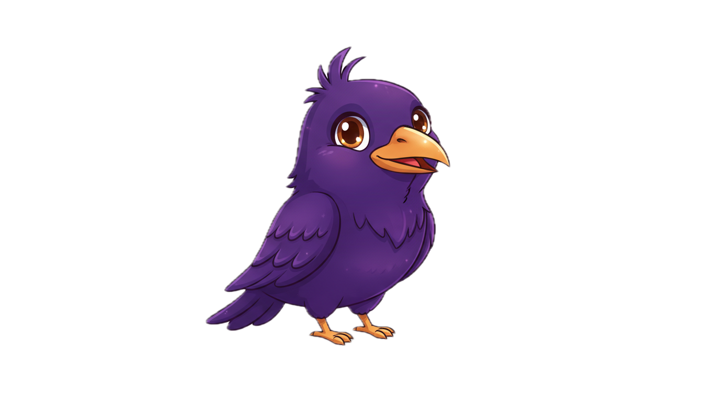
---

## Priority 1: Error Pages

### 404 — Page Not Found

**Prompt:**
```
[Core character prompt]

Pose: Vi perched on a wooden signpost with multiple arrows pointing different directions. One wing raised, consulting a tiny folded map. Looking slightly puzzled but helpful—sympathetic head tilt.

Props: Rustic wooden signpost with 3-4 arrows (no text needed), tiny folded map in wing.

Mood: "Oops, wrong turn" — gentle, understanding, slightly whimsical. Not distressed.

Expression: Soft eyes, slight smile, "I've been there" energy.

Colours: Purple Vi against neutral browns/greys of signpost. Subtle warm lighting.

Format: 800x600px, clean background suitable for web error page.
```

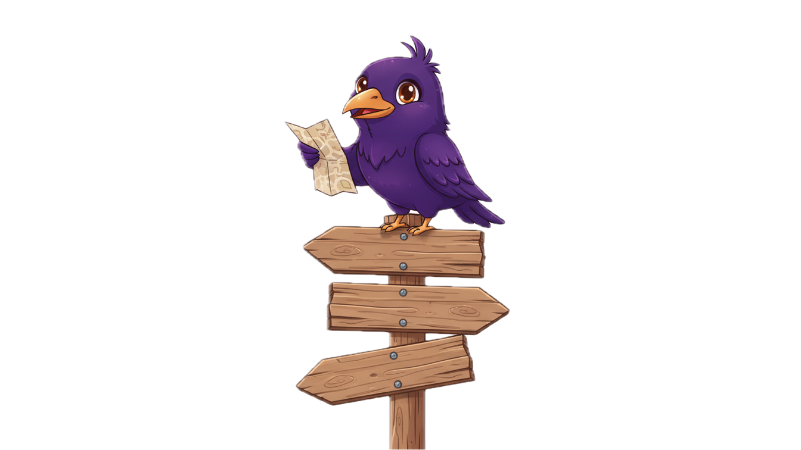

### 500 — Server Error

**Prompt:**
```
[Core character prompt]

Pose: Vi sitting at a tiny laptop, wearing small round reading glasses. One wing raised in "give me a moment" gesture. Looking focused but reassuring.

Props: Tiny silver laptop, round reading glasses, small floating tool icons (wrench, screwdriver, gear) around head, cup of tea cooling nearby (steam rising).

Mood: Competent, calm, "we've got this" energy. Fixing something, not panicking.

Expression: Concentrated but warm, slight determination.

Colours: Purple Vi, silver/grey tech elements, warm tea accent.

Format: 800x600px, light background.
```
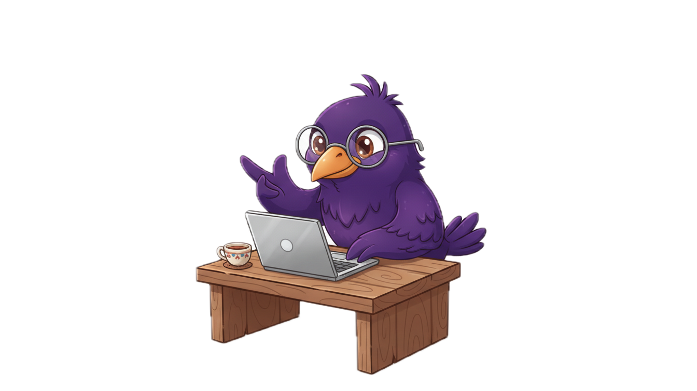

### 503 — Service Unavailable

**Prompt:**
```
[Core character prompt]

Pose: Vi wearing tiny yellow hard hat, perched on construction scaffolding or ladder, holding rolled-up blueprints. Mid-project but cheerful.

Props: Small yellow hard hat, metal scaffolding/ladder, rolled blueprints in wing, perhaps some floating bricks or tools.

Mood: Productive, optimistic, "this'll be brilliant when it's done." Busy but not stressed.

Expression: Cheerful determination, pride in work.

Colours: Purple Vi with construction yellow/orange safety accents. Industrial but friendly.

Format: 800x600px.
```

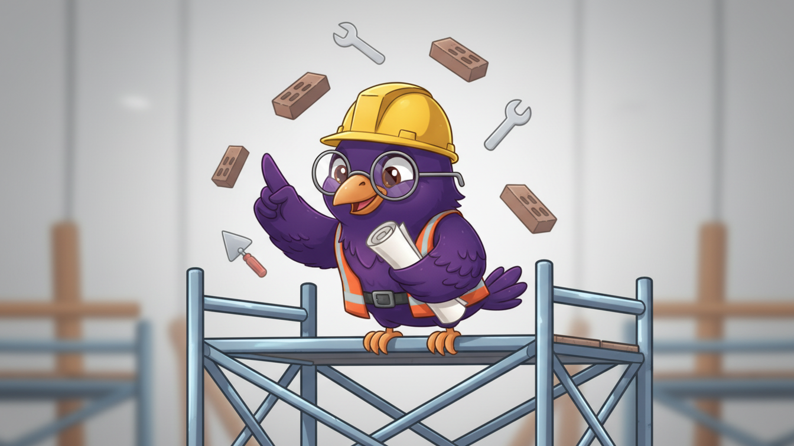

---

## Priority 2: Dashboard Welcome

**Prompt:**
```
[Core character prompt]

Pose: Vi bursting energetically out of a violet/purple circle, wings spread wide in welcoming gesture. Small "Welcome" banner held in one wing or waving enthusiastically.

Mood: Genuinely pleased to see them. Warm, welcoming, restrained joy (British enthusiasm—no over-the-top excitement).

Expression: Bright eyes, warm smile, open and inviting.

Colours: Deep violet (#663399) circle background, Vi's purple slightly lighter to pop. Gold accents in eyes.

Format: 80x64px final (design at 400x320px and scale down). Slightly overflows the circle for personality.

Note: This replaces a generic rocket icon. Vi is better.
```
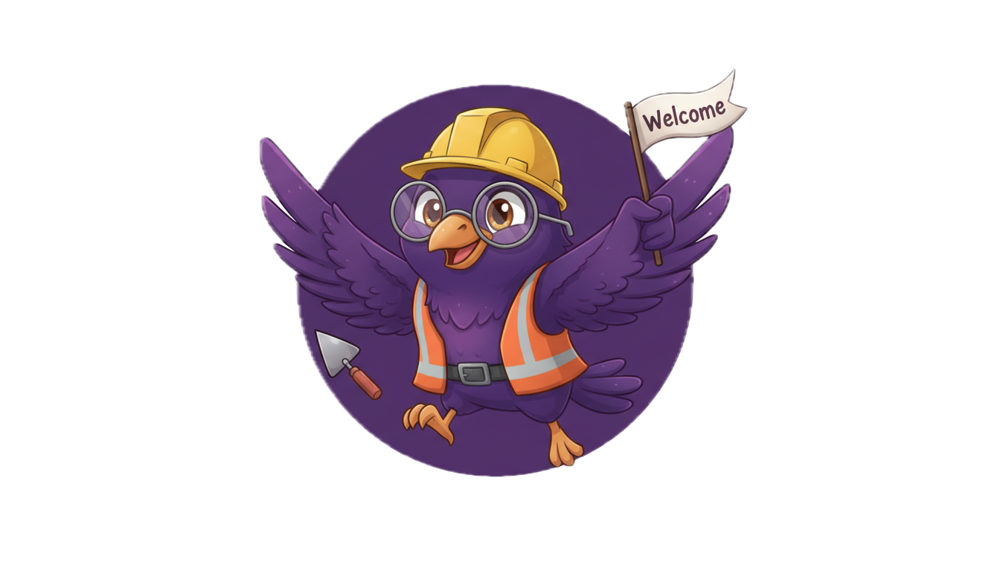
---

## Priority 3: Empty States

### Empty Dashboard

**Prompt:**
```
[Core character prompt]

Pose: Vi standing in an empty field or on blank canvas, one wing gesturing invitingly to the space. Other wing holding either a paintbrush or planting a small seedling.

Props: Either paintbrush with purple paint, OR small green seedling being planted. Background is intentionally empty/minimal—the "blank slate."

Mood: "Look at all this potential" — inspiring without being pushy. Possibility, not pressure.

Expression: Warm, encouraging, creative.

Format: 600x400px.
```

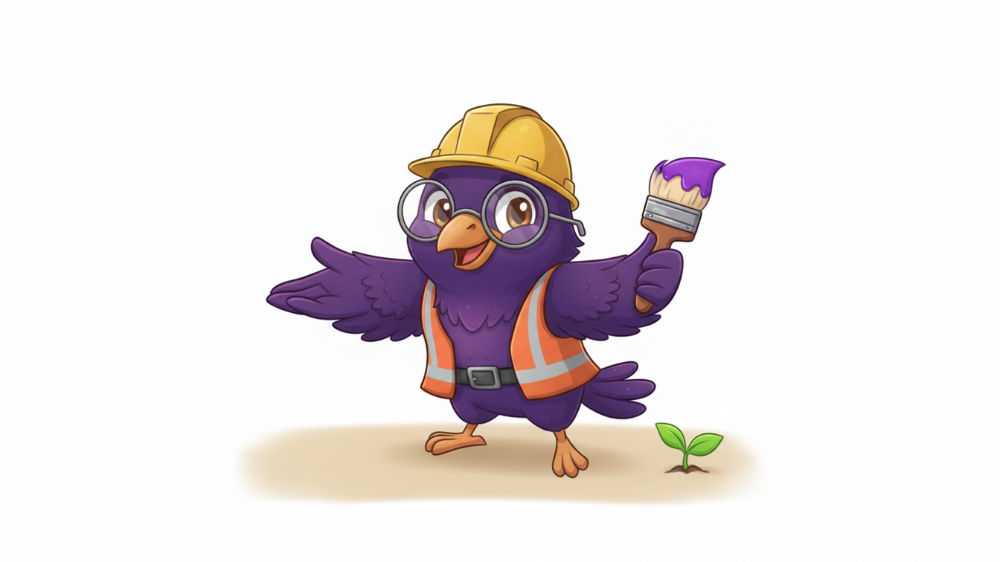

### No Scheduled Posts (SocialHost)

**Prompt:**
```
[Core character prompt]

Pose: Vi perched on edge of an empty calendar grid, pen in wing, doodling or writing ideas. Small thought bubbles floating nearby with post/content icons inside.

Props: Large calendar grid (empty squares), pen/quill in wing, 2-3 thought bubbles with abstract social post shapes.

Mood: Creative planning mode, friendly nudge. "Let's fill this up together."

Expression: Thoughtful, creative, slightly playful.

Format: 500x350px.
```

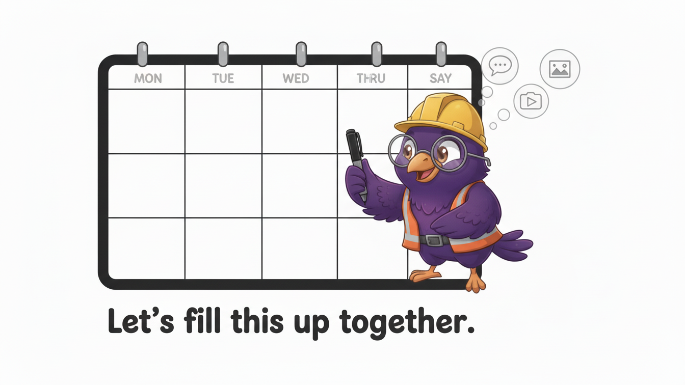

### No Connected Accounts

**Prompt:**
```
[Core character prompt]

Pose: Vi standing between floating social media platform logos (abstract shapes, not actual logos), acting as conductor or connector. Wings gesturing to bring the elements together.

Props: 3-4 floating abstract social shapes (circles, squares representing platforms), connection lines or sparkles between them.

Mood: Facilitator energy. "Let me introduce you."

Expression: Helpful guide, welcoming.

Format: 600x400px.
```

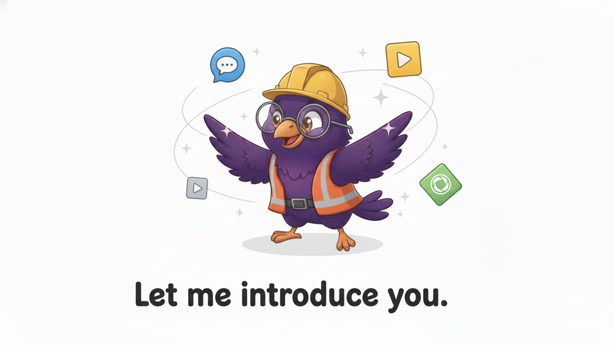

---

## Loading States

### General Loading (Tea Time)

**Prompt:**
```
[Core character prompt]

Pose: Vi sitting contentedly, holding tiny teacup, reading a small book. Completely relaxed, patient.

Props: Tiny teacup with steam, small book open in other wing.

Mood: "Take your time, I've got my tea." Content to wait, no stress whatsoever.

Expression: Pleasant, calm, patient.

Animation note: Design 3 frames — page turning subtly every 2 seconds.

Format: 120x120px (design at 360x360px).
```

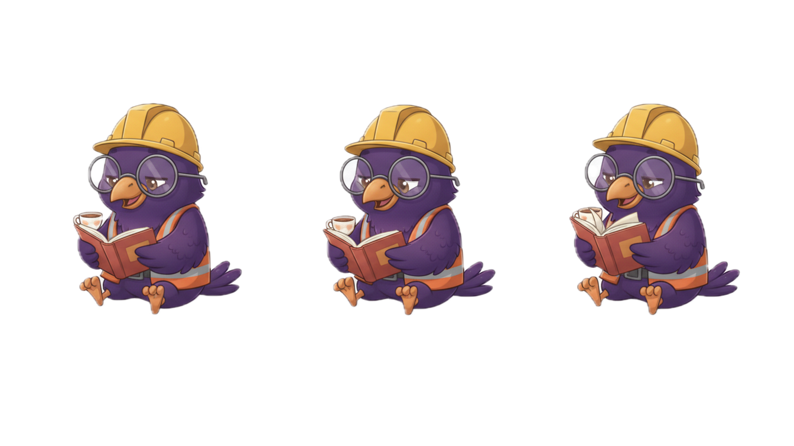

---

## Service-Specific Variants

### SocialHost Vi

**Prompt:**
```
[Core character prompt]

Context: Social media management theme.

Pose: Vi confidently juggling or managing multiple floating platform icons. In control, competent.

Props: Calendar element, scheduled posts "flying out," multiple abstract platform icons orbiting.

Mood: Organised chaos. "I've got this."

Colours: Purple base with hints of social platform colours (blues, pinks).

Format: 600x400px.
```

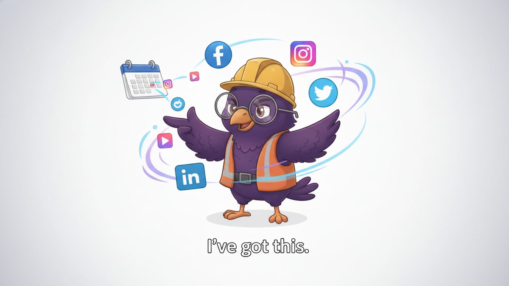

### AnalyticsHost Vi

**Prompt:**
```
[Core character prompt]

Context: Data and analytics theme.

Pose: Vi wearing reading glasses, pointing at or examining a rising chart/graph. Satisfied, analytical.

Props: Chart showing upward trend, magnifying glass optional, "no cookies" badge visible somewhere.

Mood: Insightful, satisfied with what the data shows.

Colours: Purple with data visualisation blues and greens.

Format: 600x400px.
```

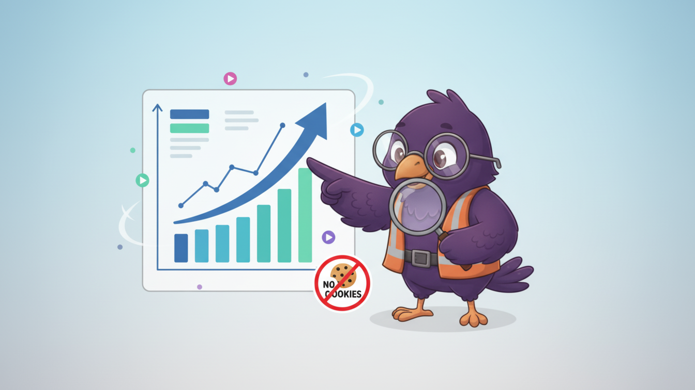

---

## Style Consistency Tips

### Do

- Keep proportions consistent (large head, compact body)
- Maintain the messy feather tuft
- Use the exact purple (#663399) as base
- Keep expressions warm, never cold or aggressive
- Ensure beak is always slightly open (approachable)
- Include the golden eye highlights

### Don't

- Make Vi realistic or photorealistic
- Use dark/gothic raven imagery
- Add more than one sparkle/star effect
- Make expressions overly excited (British restraint)
- Forget the orange-gold beak colour
- Use American-style enthusiasm in posing

---

## Technical Specifications

### Output Requirements

For each final asset, deliver:

1. **Source**: AI generation at 4x final resolution
2. **Refined**: Touch-up in Photoshop/Procreate if needed
3. **Vectorised**: Trace to SVG in Illustrator/Figma for scalability
4. **Exports**:
   - PNG @1x, @2x, @3x (retina)
   - WebP for web performance
   - SVG where appropriate
   - Dark mode variant if non-transparent background

### File Naming

```
vi-[context]-[pose]-[size].png
vi-error-404-puzzled-800x600.png
vi-loading-tea-120x120.png
vi-socialhost-juggling-600x400.png
```

---

## Quick Reference Card

| Asset           | Size    | Key Props                         | Mood                |
|-----------------|---------|-----------------------------------|---------------------|
| 404             | 800x600 | Signpost, map                     | Puzzled but helpful |
| 500             | 800x600 | Laptop, glasses, tools, tea       | Focused, competent  |
| 503             | 800x600 | Hard hat, scaffolding, blueprints | Busy, optimistic    |
| Welcome         | 80x64   | Wings spread                      | Warm greeting       |
| Empty dashboard | 600x400 | Paintbrush or seedling            | Inspiring           |
| No posts        | 500x350 | Calendar, pen                     | Creative            |
| Loading         | 120x120 | Tea, book                         | Patient             |

---

*Generate, iterate, refine. Vi should feel like someone you'd trust to help you—because she is.*
